# Bollywood

Movie guessing game with a beautiful GUI. Say goodbye to those boring lab/practical sessions 😀.
Download the cross platform desktop app or play online.
Made with [Electron.js](https://www.electronjs.org/ "Electron.js").

## 📥 Download Latest Version (v1.1.0):

 

 

## 📝 Description:

What started as a simple C++ program in first semester of college, evolved into a cross platform desktop application with a nice GUI. A professor of mine told me that the black CLI interface does not look good and a GUI would make this project very good. Indeed.
We spent a lot of time in playing this in boring lectures in our college.
I have tried to implement in the best way I could but suggestions for improvement are always welcome.

[Here](https://github.com/Aadityajoshi151/Bollywood-CPP "Here") is the link to the old C++ program if someone is interested.

## 📜 How To Use:

- Download and run the application.
- Enter the movie name. Its visibility can be toggled on/off. The camera button in the top menu bar will take you to a wikipedia page consisiting names of bollywood movies.
- Change the countdown time (if required).
  Default time is 90 seconds.
  Timer range is 10-300 seconds.
- Click on proceed.
- It will notify the user automatically if numbers or special symbols are present in the title.
- Enter the character one by one and based on your input, it will tell you whether your guess was right or wrong. Try to guess the movie before the time runs out.

## 📷 Screenshots:

**Main Menu**
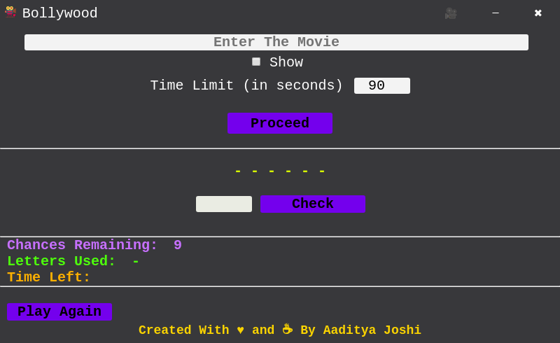

**Movie name visibility toggle**
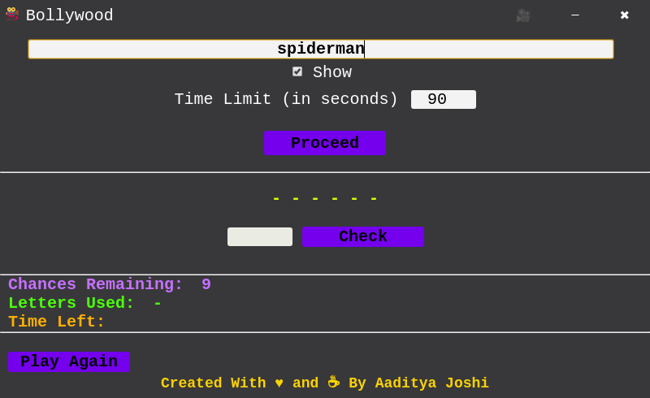

**Correct character message**
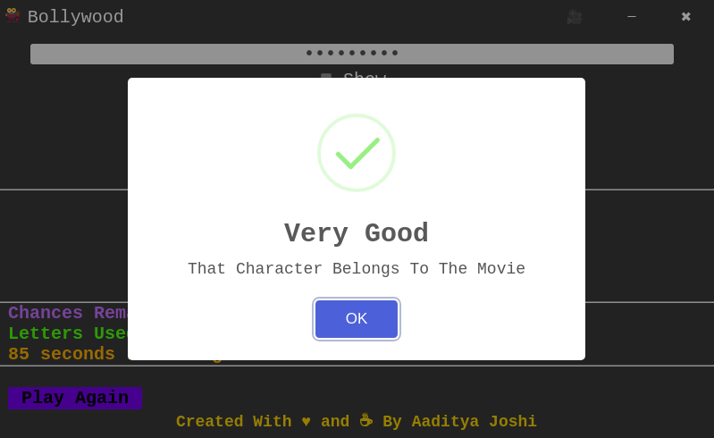

**Incorrect character message**
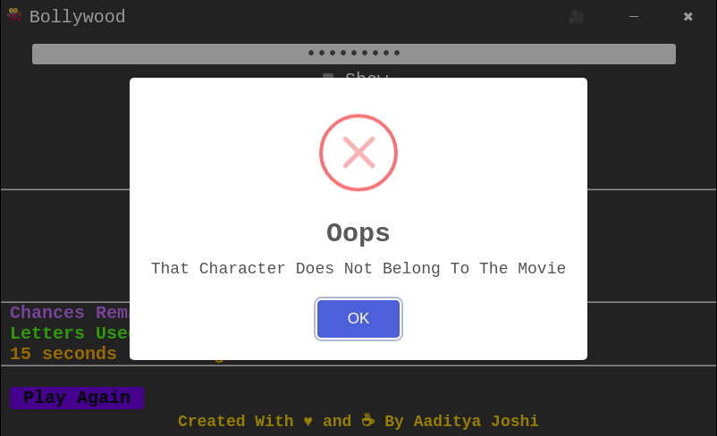

**Correct but already used character message**
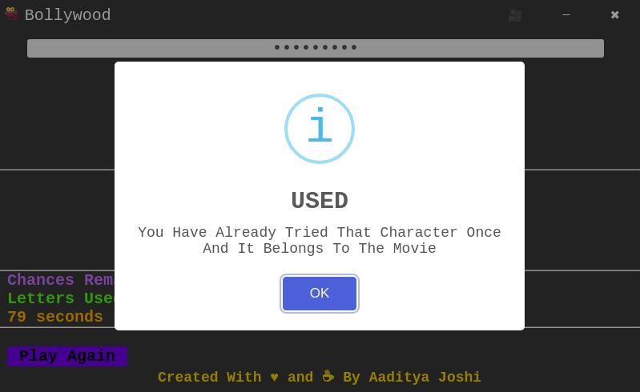

**Incorrent but already used character message**
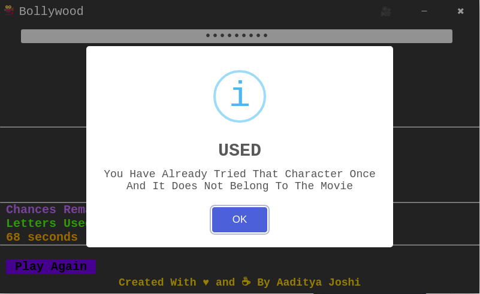

**Vowel input message**Download Latest Version
**Time-up message**
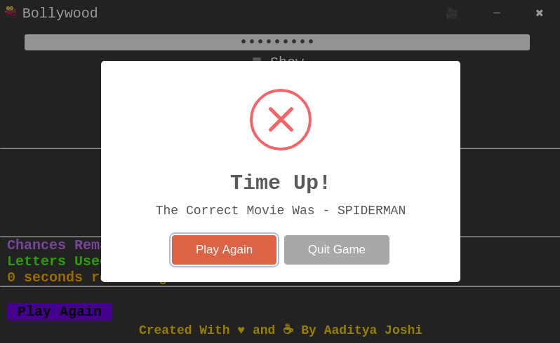

**Winning message**
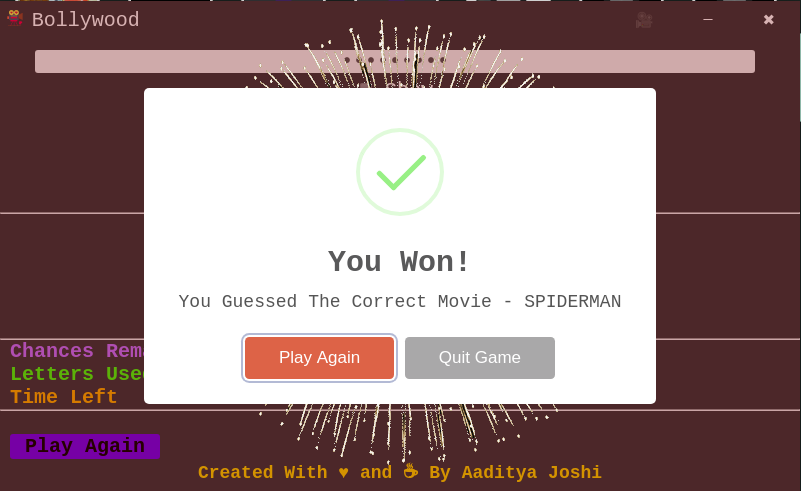

**Title with number message**
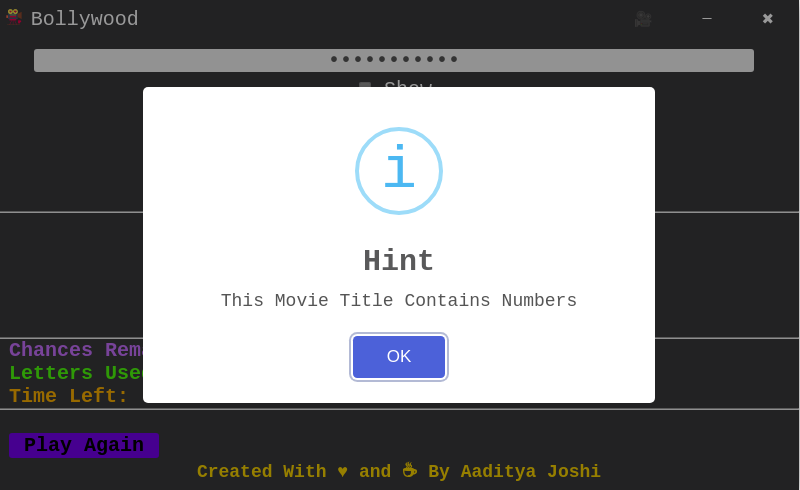

**A Title with no consonants is not allowed**
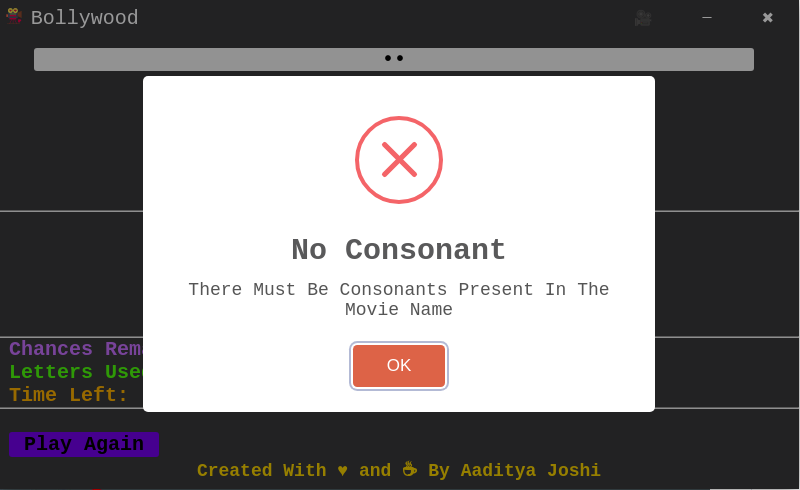

**Displaying chances and used characters**
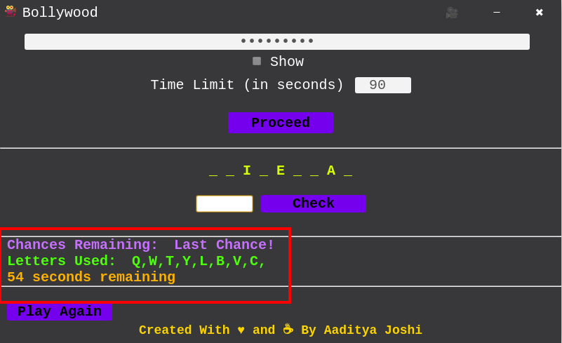

## 🙏 Credits:

- v1.1.0 [icon](https://www.iconfinder.com/icons/4171340/camera_day_love_movie_valentine_valentines_video_icon "icon") obtained from [Valentine's Day Free icon pack](https://www.iconfinder.com/iconsets/valentine-day-16 "Valentine's Day Free icon pack") designed by [Flatart](https://www.iconfinder.com/Flatart "Flatart") on [iconfinder.com](https://www.iconfinder.com/ "iconfinder.com")
- v1.0 [icon](https://www.iconfinder.com/icons/667356/camera_film_movie_shoot_vintage_icon "icon") (No longer used) obtained from [Orbicons (Free) icon pack](https://www.iconfinder.com/iconsets/ballicons-reloaded-free "Orbicons (Free) icon pack") designed by [The Pictographers](https://www.iconfinder.com/bluewolfski "The Pictographers") on [iconfinder.com](https://www.iconfinder.com/ "iconfinder.com")
