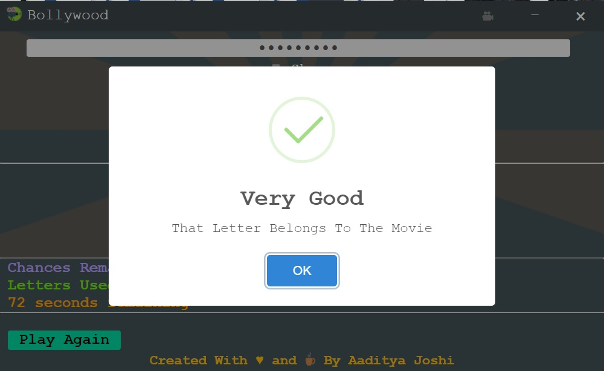
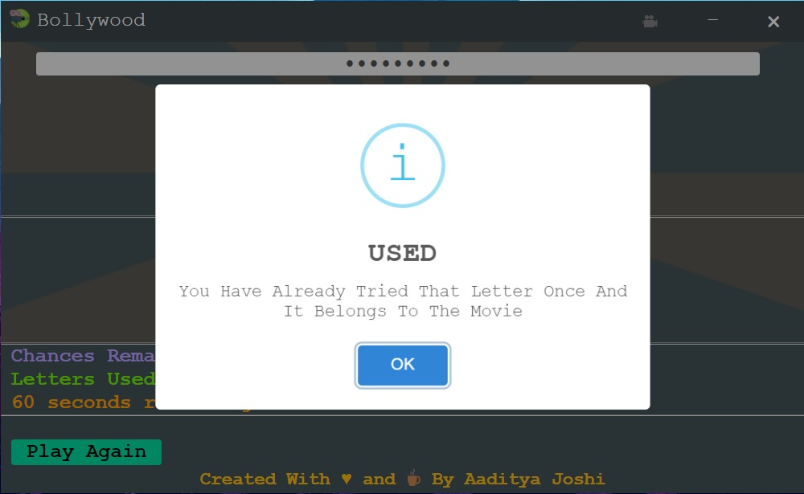
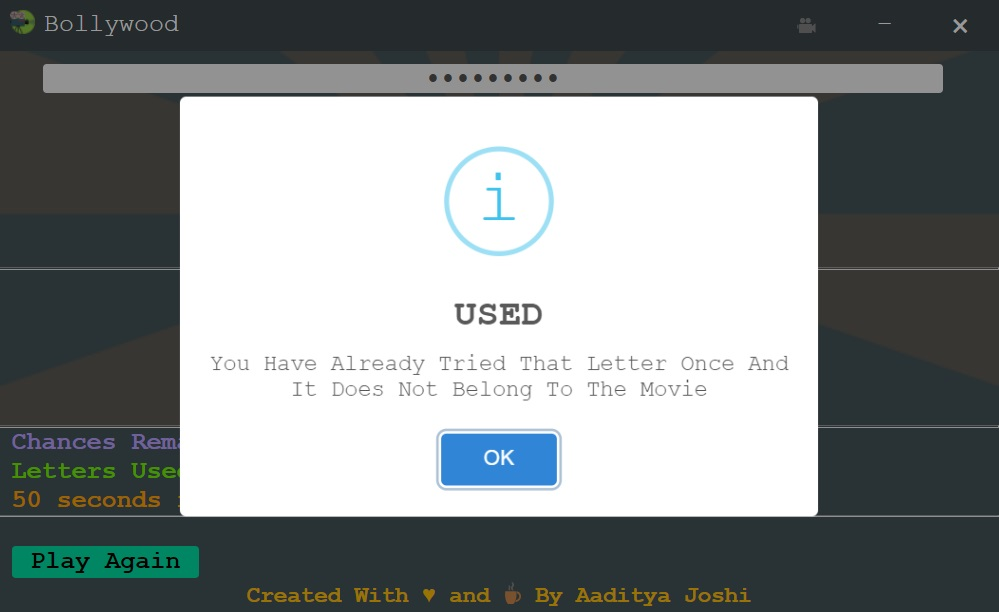
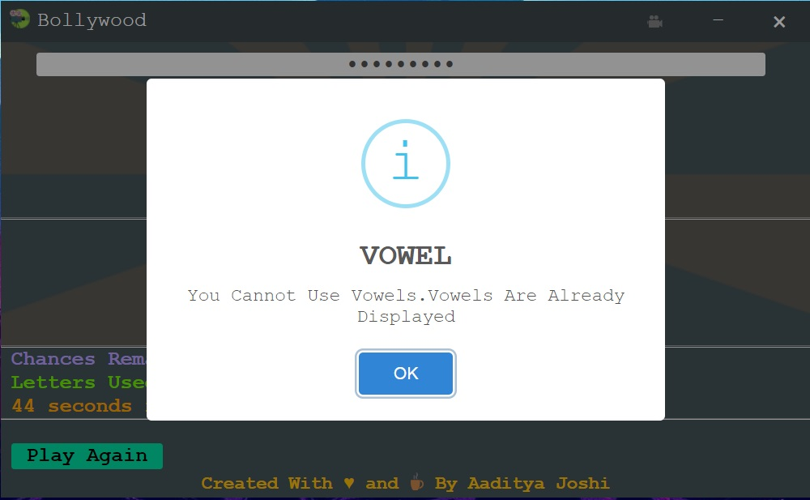
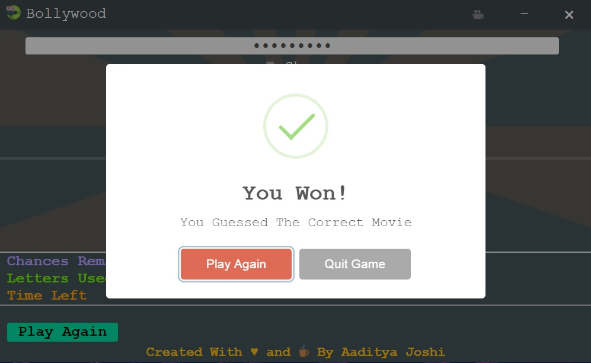
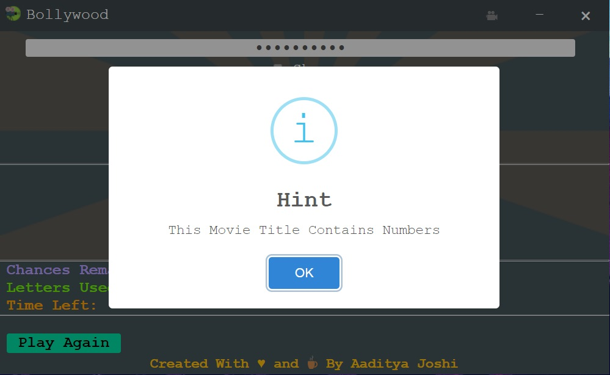
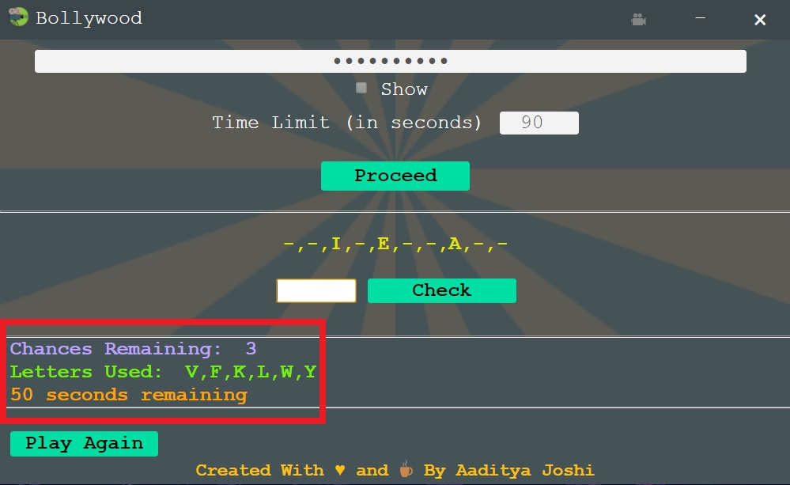

# Bollywood
Movie guessing game with a beautiful GUI. Say goodbye to those boring lab/practical sessions 😀
Made with [Electron.js](https://www.electronjs.org/ "Electron.js")

## Download Links:
Click [here](https://github.com/Aadityajoshi151/Bollywood/releases/download/v1.0/Bollywood.-.Windows.rar) to download for Windows (No installation required)

[Alternate Download Link](http://www.mediafire.com/file/6lrbmiwi141uzmd/Bollywood_-_Windows.rar/file) For Windows

## 📝 Description:
What started as a simple C++ program in first semester of college, evolved into a cross platform desktop application with a nice GUI. A professor of mine told me that the black CLI interface does not look good and a GUI would make this project very good. Indeed.
We spent a lot of time in playing this in boring lectures in our college.
I have tried to implement in the best way I could but suggestions for improvement are always welcome.
[Here](https://github.com/Aadityajoshi151/Bollywood-CPP "Here") is the link to the old C++ program if someone is interested.

## 📜 How To Use:
- Download and open 'bollywood.exe' from the zip file.
- Enter the movie name. Its visibility can be toggled on/off. The camera button in the top menu bar will take you to a wikipedia page consisiting names of bollywood movies.
- Change the countdown time (if required).
Default time is 90 seconds.
Timer range is 10-300 seconds.
- Click on proceed.
- It will notify the user automatically if numbers or special symbols are present in the title.
- Enter the letter one by one and based on your input, it will tell you whether your guess was right or wrong. Try to guess the movie before the time runs out.
📺 Watch the demo video [here](https://www.youtube.com/watch?v=6DMQYRhATLY "here").

## 📷 Screenshots:
**Main Menu**

**Movie name visibility**

**Corrent input message**

**Incorrect input message**

**Correct but already used letter message**

**Incorrent but already used letter message**

**Vowel input message**

**Time-up message**

**Winning message**

**Title with number message**

**Displaying already used messages**
